# 팀 프로젝트 GitHub 레포 사용 가이드

이 문서는 `nxtcloud-edu` organization에서 팀별로 생성된 레포를 팀원들이 어떻게 함께 사용하는지 설명합니다. Git이 처음이어도 그대로 따라오면 됩니다.

```
📋 전체 흐름 요약

팀원 초대 → Clone → 작업 브랜치 생성 → 커밋 → Push → PR 생성
→ 리뷰 & 머지 → (다음 작업 전) main 다시 pull → 새 브랜치 생성 → 반복
```

아래 목차 번호가 이 순서와 그대로 일치합니다. 순서대로 따라오면 됩니다.

---

## 1. 레포 구조 이해하기

- 모든 팀 레포는 `nxtcloud-edu` organization 아래에 생성되어 있습니다. (예: `nxtcloud-edu/team-01-project`)
- 레포는 이미 만들어져 있고, **팀장에게 Admin 권한**이 부여된 상태로 전달됩니다.
- 팀원은 레포에 직접 들어가 있지 않은 상태이므로, **팀장이 먼저 팀원을 초대**해야 작업을 시작할 수 있습니다.

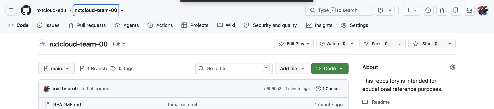

| 역할 | 권한 | 할 수 있는 것 |
|---|---|---|
| 팀장 | Admin | 팀원 초대, 브랜치 보호 설정, PR 승인/머지, 레포 설정 변경 |
| 팀원 | Write | 브랜치 생성, 커밋 push, PR 생성 |

> ### 💡 참고 — 왜 Fork를 하지 않나요?
>
> Fork는 레포를 통째로 복사해서 나만의 별도 저장소를 만드는 방식입니다. 이렇게 하면 원본 레포와 내 fork본을 계속 따로 동기화해줘야 하고, 관리해야 할 리모트(remote)도 늘어납니다.
>
> 즉, 처음부터 버전관리를 두 겹으로 하는 셈이라 초보자 입장에서는 오히려 더 헷갈리고 실수하기 쉽습니다.
>
> **그래서** 우리 팀은 Fork 없이, 모두가 같은 레포 안에서 브랜치만 나눠서 작업합니다. 리모트는 `origin` 하나만 신경 쓰면 됩니다.

---

## 2-1. [팀장 전용] 팀원 초대하기

1. 레포 페이지 상단의 **Settings** 탭 클릭
2. 왼쪽 메뉴에서 **Collaborators and teams** 클릭 (레포 설정에 따라 **Collaborators**로 보이기도 합니다)
3. **Add people** 버튼 클릭 후 팀원의 GitHub 아이디 또는 이메일 입력
4. 권한 레벨은 **Write**로 지정

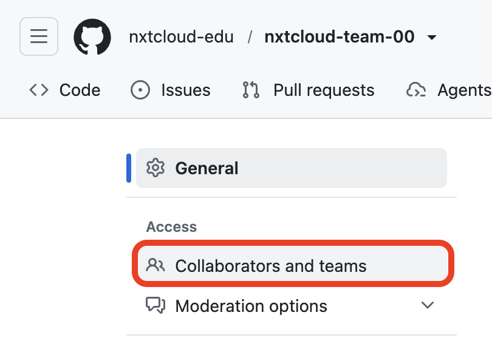

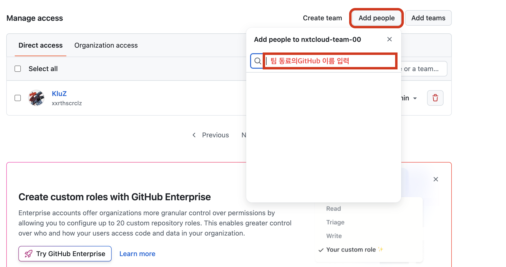

---

## 2-2. [팀원 전용] 초대 수락하기

팀장이 초대를 보내면 이메일 또는 GitHub 알림으로 초대 메시지가 도착합니다. 메일이나 알림에 있는 링크를 열어서 **Accept invitation**(초대 수락) 버튼을 누르면 레포에 접근할 수 있게 됩니다.

---

## 3. [팀원] 내 컴퓨터에 레포 가져오기 (Clone)

초대를 수락했다면, 이제 레포를 내 컴퓨터로 내려받습니다.

1. 레포 페이지에서 초록색 **Code** 버튼 클릭 → HTTPS 주소 복사
2. 터미널에서 아래 명령어 실행

```bash
git clone https://github.com/nxtcloud-edu/레포이름.git
cd 레포이름
```

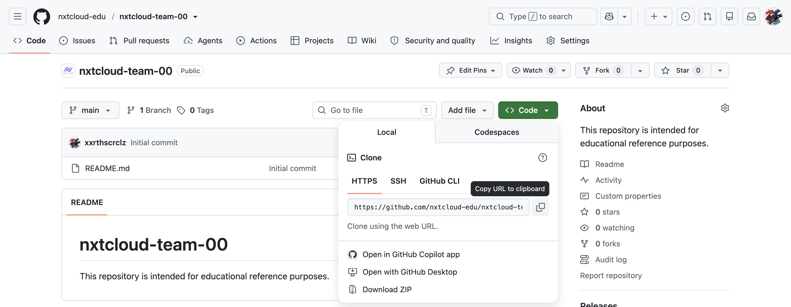

clone이 끝나면 원격 저장소가 자동으로 `origin`이라는 이름으로 등록됩니다. 아래 명령어를 쳤을 때 `origin` 주소와 함께 `(fetch)`, `(push)` 두 줄이 뜨면 정상적으로 잘 연결된 것입니다.

```bash
git remote -v
# origin  https://github.com/nxtcloud-edu/레포이름.git (fetch)
# origin  https://github.com/nxtcloud-edu/레포이름.git (push)
```

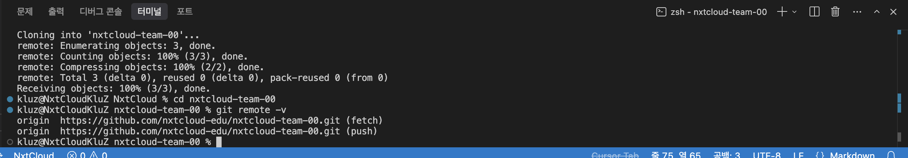

---

## 4. 작업 브랜치 만들기

```bash
# main을 최신 상태로 업데이트
git checkout main
git pull origin main

# 새 브랜치 생성 및 이동
git checkout -b feature/내작업이름
```

`git checkout -b` 실행 후 터미널 프롬프트 앞부분이 `(feature/내작업이름)`처럼 바뀌면 잘 된 것입니다.

브랜치 이름 예시: `feature/login-page`, `fix/navbar-bug`, `docs/readme-update`

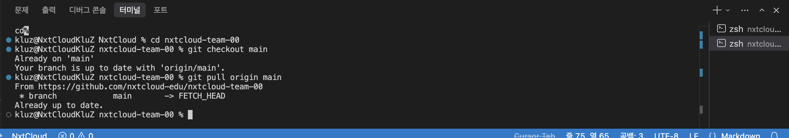

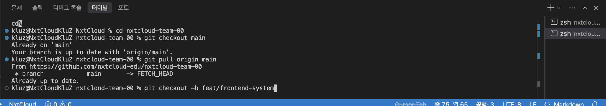

> ### 💡 참고 — 왜 브랜치를 따로 만드나요?
>
> 만약 팀원 모두가 `main` 브랜치에서 바로 작업하고 각자 push한다면, 서로의 변경 사항이 겹치면서 **conflict(충돌)**가 계속 발생하고 프로젝트 히스토리가 뒤죽박죽 엉키게 됩니다.
>
> 그래서 각자 자기 작업만 담을 브랜치를 따로 만들고, 작업이 끝나면 PR로 합치는 방식을 씁니다. 이렇게 하면 `main`은 항상 안전하고 깨끗한 상태로 유지됩니다.

---

## 5. 코드 작업 후 커밋하기

```bash
# 변경된 파일 확인
git status

# 변경 사항 스테이징
git add .

# 커밋
git commit -m "타입: 작업 내용"
```

`git status`는 수정된 파일 목록이 빨간색(스테이징 전)으로, `git add .` 이후엔 초록색(스테이징 완료)으로 뜨면 잘 된 것이고, `git commit`은 `[브랜치명 해시값] 커밋 메시지` 같은 한 줄이 뜨면 잘 된 것입니다.

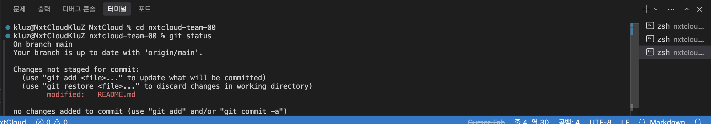

### 커밋 메시지 컨벤션

형식: `타입: 무엇을 했는지 한 줄 설명`

| 타입 | 의미 | 예시 |
|---|---|---|
| `feat` | 새 기능 추가 | `feat: 로그인 페이지 UI 추가` |
| `fix` | 버그 수정 | `fix: 네비게이션 바 깨지는 버그 수정` |
| `docs` | 문서 작업 | `docs: README 사용법 업데이트` |
| `style` | 디자인/코드 스타일 (기능 변화 없음) | `style: 버튼 색상 및 여백 조정` |
| `refactor` | 코드 구조 개선 (동작은 동일) | `refactor: 로그인 로직 함수로 분리` |
| `test` | 테스트 코드 | `test: 로그인 폼 유효성 테스트 추가` |
| `chore` | 그 외 잡다한 작업 (설정, 패키지 등) | `chore: 패키지 버전 업데이트` |

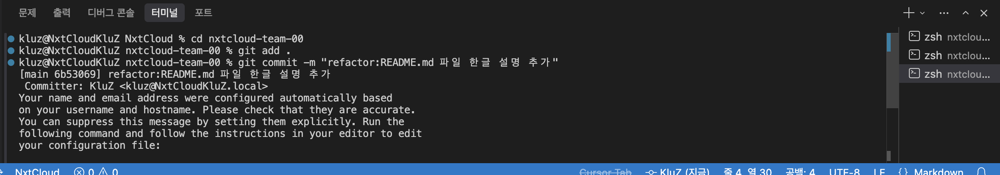

---

## 6. 원격 저장소로 Push하기

내가 만든 브랜치를 `origin`(레포)으로 올립니다.

```bash
git push -u origin feature/내작업이름
```

`-u` 옵션은 처음 push할 때만 필요하고, 이후에는 `git push`만 입력해도 됩니다.

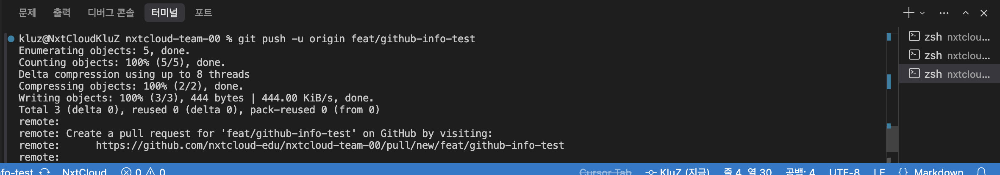

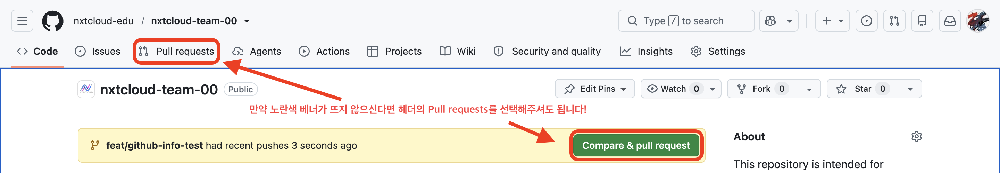

---

## 7. Pull Request(PR) 만들기

1. push가 끝나면 GitHub 레포 페이지에 **"Compare & pull request"** 버튼이 자동으로 뜹니다. 클릭
   (또는 레포 상단 **Pull requests** 탭 → **New pull request**에서 직접 만들 수도 있습니다)
2. base는 `main`, compare는 내 브랜치인지 확인
3. 제목과 설명을 작성 후 **Create pull request** 클릭

PR에 어떤 내용을 쓸지는 팀끼리 자유롭게 정하면 되지만, 아래와 같은 형식을 예시로 참고하면 좋습니다.

**PR 제목 예시**
```
[Feature] 로그인 페이지 UI 작업
```

**PR 본문 예시**
```
## 작업 내용
- 로그인 페이지 UI 퍼블리싱
- 이메일/비밀번호 입력 폼 구현

## 스크린샷
(작업한 화면 스크린샷 첨부)

## 테스트 방법
1. npm run dev 실행
2. /login 페이지 접속
3. 폼 정상 동작 확인

## 참고 사항
- 다음 PR에서 로그인 API 연동 예정
```

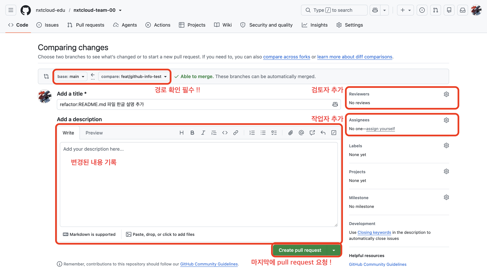

---

## 8. 리뷰 & 머지

- 기본적으로는 **팀원들이 서로 리뷰**해주는 것을 권장합니다. 코드를 같이 보면서 실수도 줄이고 서로 배울 수 있습니다.
- 팀원 리뷰가 어려운 상황이면 **팀장(Admin)이 리뷰 및 승인**을 진행합니다.
- 수정 요청이 있으면 같은 브랜치에 커밋을 추가로 push하면 PR에 자동 반영됩니다.
- 승인이 끝나면 **Merge pull request** 버튼으로 `main`에 병합합니다.

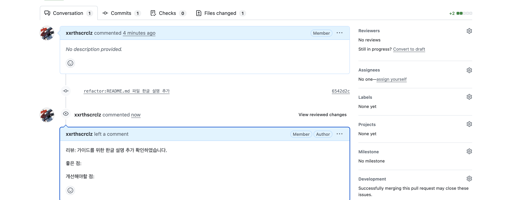

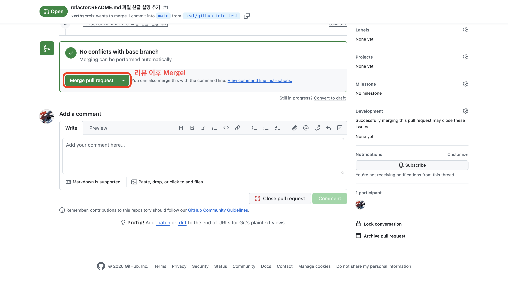

머지가 끝난 브랜치는 GitHub에서 **Delete branch** 버튼으로 정리해도 됩니다.

---

## 9. 다음 작업 시작 전 체크리스트

새 작업을 시작하기 전에는 항상 `main`을 최신 상태로 맞추고 시작합니다.

```bash
git checkout main
git pull origin main
git checkout -b feature/다음작업이름
```

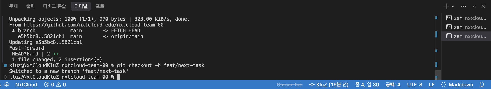

---

## 10. 자주 쓰는 명령어 요약

| 상황 | 명령어 |
|---|---|
| 레포 내려받기 | `git clone <주소>` |
| 브랜치 목록 확인 | `git branch` |
| 새 브랜치 만들고 이동 | `git checkout -b <브랜치이름>` |
| 브랜치 이동 | `git checkout <브랜치이름>` |
| 변경 사항 확인 | `git status` |
| 변경 사항 담기 | `git add .` |
| 커밋 | `git commit -m "타입: 메시지"` |
| 원격에 올리기 | `git push -u origin <브랜치이름>` |
| main 최신화 | `git pull origin main` |
| 리모트 확인 | `git remote -v` |

---

## 11. 용어 한 줄 정리

- **Clone**: 원격 레포를 내 컴퓨터로 복사해오는 것
- **Branch**: 원본(main)을 건드리지 않고 따로 작업할 수 있는 작업 공간
- **Commit**: 변경 사항을 하나의 기록 단위로 저장하는 것
- **Push**: 내 커밋을 원격 저장소(origin)로 올리는 것
- **Pull Request(PR)**: "이 브랜치 내용을 main에 합쳐줘"라는 요청
- **Merge**: PR을 실제로 main에 합치는 작업
- **Admin / Write 권한**: Admin은 레포 설정·팀원 관리까지 가능, Write는 브랜치 생성·push·PR까지만 가능 (설정 변경 불가)

---

막히는 부분이 있으면 팀장에게 먼저 물어보고, 필요하면 이 문서에 내용을 추가해주세요.
